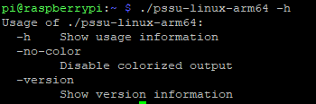
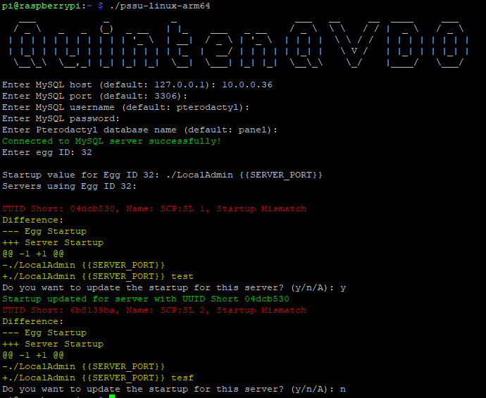
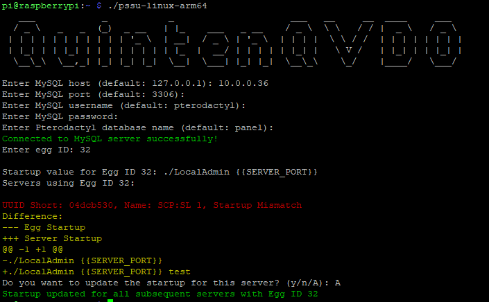

# PteroTools

This is a very simple Golang application that connects to the Pterodactyl panel database. Gets the startup from the provided egg ID and then see if it matches, if not you can update the startup to the current one from the egg, leave it like it is or apply the updated startup to all servers using that egg. This is mainly made for if with an egg update, the startup gets updated, and you do not want to go and manual change every startup of already running servers. It now also supports stopping stuck server transfers.

## How To Use It
1. Go to the release tab on GitHub
2. Download the binary for your system (linux-amd64, linux-arm64, windows-amd64)
3. On Linux chmod +x the binary, on Windows this is not needed
4. it will prompt you for the MySQL login details
5. It will let you enter the egg ID
6. It will print the stock startup and servers using the egg
7. It will give you the option to update the startup (y), to leave that server startup like it is (n), or update all the startups at ones (a)

## Extra Flags
- `-no-color` to hide the little color that is in the terminal
- `-version` to print the current version you are running
- `-help` to print the list of available commands

## Used External Modules
- `github.com/go-sql-driver/mysql` for connection with MySQL and running MySQL commands
- `github.com/pmezard/go-difflib/difflib` for displaying the difference in startup
- `golang.org/x/term` for securely letting you enter the MySQL password

## Images (old)

